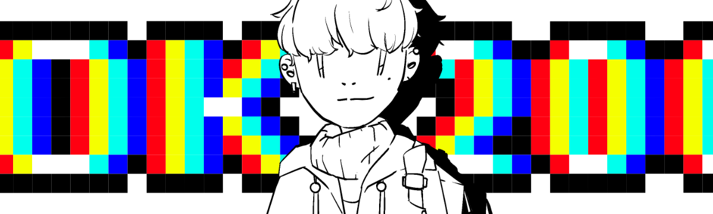

# Hi! I'm YUANCONG 🍟

[][website]

## About me
- 🗼 I'm an incoming engineer of [teamLab][teamlab]
- 🎓 I graduated from [University of Glasgow][uofg]
- 💻 I'm currently working on Java and Swift
- 🎬 I'm a big fan of horror movies
- 💬 I speak Chinese, English, Japanese and Korean

## Latest blog posts
<!-- BLOG-POST-LIST:START -->
- [Note | 在WebMvcConfiguration介面中配置過濾器（Filter）](https://blog.yuan-cong.com/2022/03/05/FilterInWebMvcConfig/)
- [講一講日本考學和求職的心路歷程](https://blog.yuan-cong.com/2022/03/05/BeforeLifeInJapan/)
- [Note | cron表達式](https://blog.yuan-cong.com/2022/02/26/Note-cron/)
- [Note | 用Spring Boot和Thymeleaf製作Todo系統 &lt;#1&gt;](https://blog.yuan-cong.com/2022/02/16/TodoWithSpringBootAndThymeleaf/)
- [Note | Spring Boot Message 配置問題](https://blog.yuan-cong.com/2022/02/16/MessagesInSpringBoot/)
<!-- BLOG-POST-LIST:END -->

## Connect with me
[][website]
[][blog]
[][linkedin]
[][youtube]
[][mail]

[website]: https://www.yuan-cong.com
[blog]: https://blog.yuan-cong.com
[linkedin]: https://www.linkedin.com/in/yuancong-liu/
[youtube]: https://www.youtube.com/channel/UCbTbqyNbV_T_jhdRMSCf5Og
[mail]: mailto:yuanc129.liu@yahoo.com
[teamlab]: https://www.teamlab.art
[uofg]: https://www.gla.ac.uk

 
